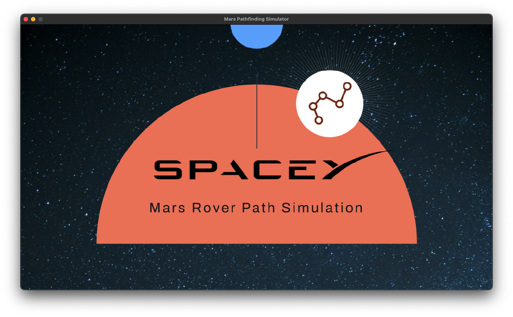
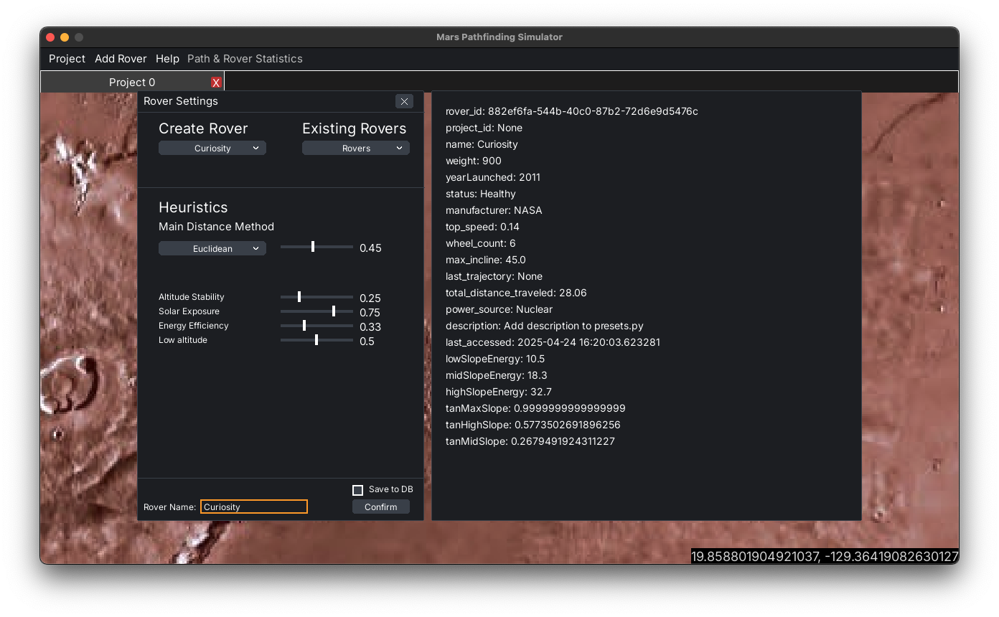
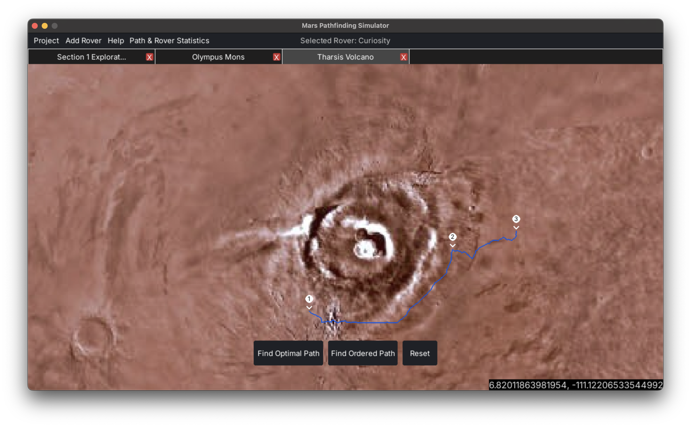
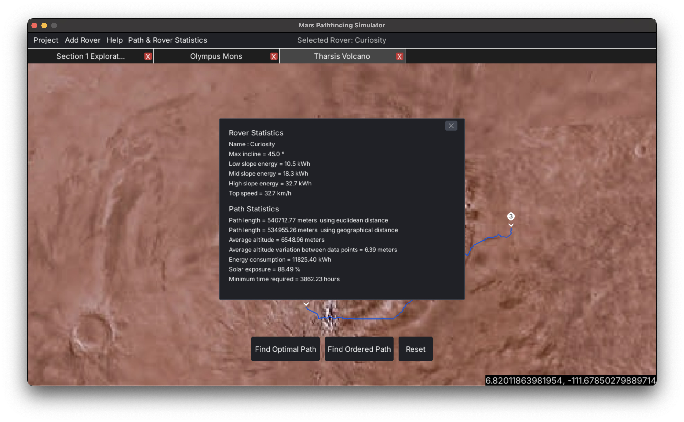

# Mars Rover Simulator

Simulate Mars rover missions using real terrain data and advanced pathfinding algorithms.

<p align="center">
  
  
  
  
</p>

## Features

- **Real Mars Terrain**: Utilizes [NASA's HRSC MOLA BlendDEM Global 200m dataset](https://astrogeology.usgs.gov/search/map/mars_mgs_mola_mex_hrsc_blended_dem_global_200m).
- **Custom Rover Creation**: Design your own rover or select from presets (Curiosity, Perseverance, Lunokhod 1, and Lunokhod 2.)
- **Advanced Pathfinding**: Supports multiple algorithms (A\*, BFS, DFS, etc.) with customizable heuristics weighting.
- **Project Management**: Create, save, load, and delete multiple projects, each with its own set of rovers and mission parameters.
- **Interactive Map**: Select areas of interest, place path markers, and visualize computed paths.
- **Simulation Statistics**: Analyze path and rover statistics, including distance traveled, energy consumption, and mission duration.
- **Database Integration**: All projects and rover configurations are stored in a local SQLite database.

## Installation

1. **Clone the repository**

   ```sh
   git clone https://github.com/seagram/MarsRoverSimulator.git
   ```

2. **Change into the project directory**

   ```sh
   cd MarsRoverSimulator
   ```

3. **Run the setup script**

   ```sh
   ./setup.sh
   ```

4. **Run the simulator**

   ```sh
   python3 main.py
   ```

## Contributions

This project was a collaborative effort by our team:

- [@SoloUnity](https://github.com/SoloUnity)
- [@matperu](https://github.com/matperu)
- [@shebss](https://github.com/shebss)
- [@MatthewSp1](https://github.com/MatthewSp1)
- [@noahlepage](https://github.com/noahlepage)
- [@ShawnYs-codemtl](https://github.com/ShawnYs-codemtl)
